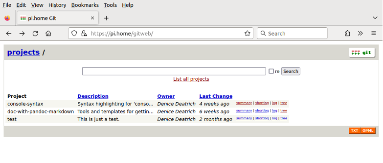

<!-- -->
# Starting your own Git service {#chapter-13}

Services like [github.com][github] are wonderful, but sometimes it is useful
and necessary to create your own Git server.  You might have extremely
sensitive data that cannot be exposed on public servers.  Sometimes at work
you might have internal networks which are deliberately shielded from the
public internet, and you might want to play with git at home to learn about
running your own server.

Here we look at installing and configuring a Git service.  We will also 
install *gitweb* so that we have a web interface for browsing the git
repositories.  It will not be as funky as *github*, but it will still be
useful.

The git service documented here supports 2 protocols accessing our git
repositories.  Of course, these services are for our home LAN:

   * SSH -- only this protocol allows read-write access to our repositories.
            Each git user provides their public ssh key to have access.  The
            linux owner 'git' stores these public keys in the associated 
            authorized keys file.
   * Git -- this protocol allows read-only access to the repositories.
            You might decide not to offer this protocol; however it
            can be useful if you are experimenting with automatic installations
            and you want to automatically pull git-stored configuration 
            information on the fly without fiddling with an ssh configuration.

[github]: https://github.com/

## Installing and configuring Git services

If 'git' is not yet installed, then do it.  The Debian git package also
includes a git server binary, and a git 'shell':

```console
$ sudo apt install git
...
Selecting previously unselected package liberror-perl.
Selecting previously unselected package git-man.
Selecting previously unselected package git.
...

// You can get a listing of all components of the git package and search
// for specific files:
$ dpkg -L git | grep daemon
/usr/lib/git-core/git-daemon
/usr/lib/git-core/git-credential-cache--daemon

$ dpkg -L git | grep shell
/usr/bin/git-shell
/usr/lib/git-core/git-shell
/usr/share/doc/git/contrib/git-shell-commands
/usr/share/doc/git/contrib/git-shell-commands/README
...
```

There are a couple of envelope packages for *git-daemon* offered by Ubuntu:

   * git-daemon-run
   * git-daemon-sysvinit

The documentation for *git-daemon-run* claims: 

```console
$ apt show git-daemon-run
...
 git-daemon, as provided by the git package, is a simple server for git
 repositories, ideally suited for read-only updates, i.e. pulling from git
 repositories through the network.  This package provides a runit service
 for running git-daemon permanently.  This configuration is simpler and
 more reliable than git-daemon-sysvinit, at a cost of being less
 familiar for administrators accustomed to sysvinit.
```

We will not use either package for a read-only git pull service; instead we
will install *xinetd* and then the daemon will listen for requests
and respond.  Note that if you do not want a read-only git pull service then
you can skip the section on *Setting up the Git Protocol*.

### Setting up the repository

First we need a user, as well as a defined group for that user:

```console
// I picked an unused uid and gid less than 1000 (regular users start at uid 1000):
$ sudo groupadd -g 600 git
$ sudo useradd -u 600 -g git -m -s '/usr/bin/git-shell' -c 'Code Versioning' git
$ ls -la /home/
ls -la /home/
drwxr-xr-x  4 root     root       33 Jul  7 16:11 .
drwxr-xr-x 21 root     root     4096 Jul  6 14:40 ..
drwxr-x--- 27 myname   myname   4096 Jul  7 16:08 myname
drwxr-x---  5 git      git        58 Jul  6 14:43 git
```
Then we need a directory for the repositories.  I decide to put it in /var/www/.
Since I already back up that directory then I don't need to change my backup
configuration.

```console
$ sudo mkdir /var/www/git
$ sudo chown git:git /var/www/git

// And lets make it easy to specify git service paths by creating a symbolic
// link to the repository's top directory:
$ sudo ln -s /var/www/git /git
```
#### Adding a test repository

To do some testing we need an initial repository.  We need to become
the **git user** with sudo.  For each repository that we create we go
through this process.  Typically home users do not make dozens of repositories,
so it is not an onerous task.  The [repository creation process](#new-git-repo)
is outlined in the appendix.

Here we do a one-time clean of the 'git' user's directory - we want to avoid
unneeded login configuration files since no one is allowed to login as git
except yourself via sudo.

```console
$ sudo -u git /bin/bash
$ cd
$ id
uid=600(git) gid=600(git) groups=600(git)
$ ls -a
drwxr-x--- 2 git  git    57 Jul  7 16:11 .
drwxr-xr-x 5 root root   45 Jul  7 16:11 ..
-rw-r--r-- 1 git  git   220 Jan  6  2022 .bash_logout
-rw-r--r-- 1 git  git  3771 Jan  6  2022 .bashrc
-rw-r--r-- 1 git  git   807 Jan  6  2022 .profile

// remove the bash files to keep the git user's life simple
$ rm .bash* .profile
```

### Setting up the *Git* protocol

Do not bother with this service is you will not use read-only git pulls.

We install *xinetd* and configure it to listen for git requests:

```console
// Install xinetd:
$ sudo apt install xinetd

$ systemctl list-unit-files | grep -i xinet
xinetd.service                             generated       -

$ cd /etc/xinet.d/

// Note that none of these services are enabled -- they are traditional
// services from the past.  We will create a 'git' service and enable it:
$ ls
chargen      daytime      discard      echo      servers  time
chargen-udp  daytime-udp  discard-udp  echo-udp  services time-udp

$ sudo touch git
$ sudo nano git
$ cat git
## description: The git dæmon allows git repositories to be exported using \
##       the git:// protocol.

service git
{
        disable         = no
        socket_type     = stream
        wait            = no
        user            = nobody
        flags           = IPv4
        server          = /usr/lib/git-core/git-daemon
        server_args     = --base-path=/var/www/git --syslog --inetd --verbose
        log_on_failure  += USERID
}

$ sudo systemctl restart xinetd
$ systemctl status xinetd
...
Jul 06 13:41:59 pi.home xinetd[175277]: 2.3.15.3 started with libwrap loadavg l>
Jul 06 13:41:59 pi.home xinetd[175277]: Started working: 1 available service
```
Let's give it a test.  We will clone the *test* repository, even though it is
pretty much empty:
<!-- add 'new to git' footnote about .gitconfig ? -->

```console
// I clone it on my 'desktop' host.  Since the configuration of the Git service
// already knows the base path to the repositories then we do not add its path
// to the clone URL:
$ git clone git://pi.home/test
Cloning into 'test'...
warning: You appear to have cloned an empty repository.

$ cd test
$ git ls-remote
From git://pi.home/test

// we can remove it; we will test again when the ssh protocol is ready:
$ cd ..
$ rm -rf test
```

### Setting up the *SSH* protocol

First we become the 'git' user and do 2 things:

   * We need to allow access to the git user in the secure-shell daemon's 
     configuration file
   * We create a *git-shell-commands* directory and add an informational script.


We add access to the git user in */etc/ssh/sshd_config*:

```console
$ sudo nano /etc/ssh/sshd_config
$ sudo tail -2 /etc/ssh/sshd_config
AllowUsers  myname@192.168.1.* git@192.168.1.* ...
$ sudo systemctl reload sshd
```

By default 'git-shell' does not allow users to ssh into the git server and get
access to the command-line -- here is an example:

```console
$ ssh git@pi.home
fatal: Interactive git shell is not enabled.
hint: ~/git-shell-commands should exist and have read and execute access.
Connection to pi.home closed.
```

So we create a script that gives a more informational message:

```console
$ whoami
git
$ cd
$ mkdir git-shell-commands
$ touch git-shell-commands/no-interactive-login
$ chmod 555 git-shell-commands/no-interactive-login
$ nano git-shell-commands/no-interactive-login 
$ cat git-shell-commands/no-interactive-login 
#!/bin/sh
printf '%s\n' "Hi $USER! You've successfully authenticated, but I do not"
printf '%s\n' "provide interactive shell access."
exit 128
$ exit
```

So we try to ssh into the server again from the desktop host:

```console
$ ssh git@pi.home
Hi git! You've successfully authenticated, but I do not
provide interactive shell access.
Connection to pi.home closed.
```

We also need to create a personal *.ssh* directory and add an
*authorized_keys* file.  Then we will add new users' public ssh keys
to this file.  This process is [detailed in the appendix](#new-git-user).

Finally we test the ssh protocol for access to git services:

```console
$ hostname
desktop.home
$ git clone ssh://git@pi.home/git/test
Cloning into 'test'...
warning: You appear to have cloned an empty repository.
$ cd test
$ git ls-remote
From ssh://git@pi.home/git/test

// If you don't like using 'master' as the initial branch name, then you
// can change it.  I did not do that here, but you could change it to 'main'
// with this command:    git config --global init.defaultBranch main

// Let's add something to the test repo:
$ cp -p /path/to/myxt .
$ git add myxt 

// When you commit your changes you will be prompted to add a comment
// in your editor of choice (typically 'nano') but for me it is 'vim'.
$ cat ~/.gitconfig
[user]
        name = Your Name
        email = your.name@somewhere.com
[core]
        editor = vim

$ git commit -a
[master (root-commit) 254c31c] - test commit.
 1 file changed, 6 insertions(+)
 create mode 100755 myxt

$ git push origin master
Counting objects: 3, done.
Delta compression using up to 6 threads.
Compressing objects: 100% (2/2), done.
Writing objects: 100% (3/3), 295 bytes | 0 bytes/s, done.
Total 3 (delta 0), reused 0 (delta 0)
To ssh://git@pi.home/git/test
 * [new branch]      master -> master
$ git status
 # On branch master
 nothing to commit, working directory clean
```

## Setting up **gitweb** for web access to Git repositories

Note that *gitweb* requires a functioning web service on the server; here I
assume that the [Apache server is installed and running](#chapter-11).

First we install and configure gitweb.  The Ubuntu *gitweb* package is just
a wrapper for gitweb -- instead the actual gitweb files are part of the *git*
package:

```console

$ dpkg -S /usr/share/gitweb
git: /usr/share/gitweb

$ sudo apt install gitweb 
...
Setting up gitweb (1:2.34.1-1ubuntu1.9) ...
apache2_invoke: Enable configuration gitweb

// Now we alter '/etc/gitweb.conf' so that it matches our setup:
$ sudo cp -p /etc/gitweb.conf /etc/gitweb.conf.orig
$ sudo nano /etc/gitweb.conf
$ diff /etc/gitweb.conf.orig /etc/gitweb.conf
2c2
< $projectroot = "/var/lib/git";
---
> $projectroot = "/var/www/git";
14a15
> $projects_list = "/git/projects_list_for_homegit";
```

Before trying to access gitweb in the browser we want to enable the cgi module.

```console
$ sudo a2enmod cgi
Enabling module cgi.
To activate the new configuration, you need to run:
  systemctl restart apache2
```

We also want to create and maintain a 'projects_list' file - this is another
thing that you do for each new repository, so [its description](#new-git-repo)
is found in the appendix.

Once you have a git repository hosted by your Linux server, then you can 
access it on your Linux server's web site.  Assuming the hostname
is *pi.home* the go to:

  https://pi.home/gitweb/

It should look something like this:

{#id .class width=100%}

<!--
```console
```
 -->
